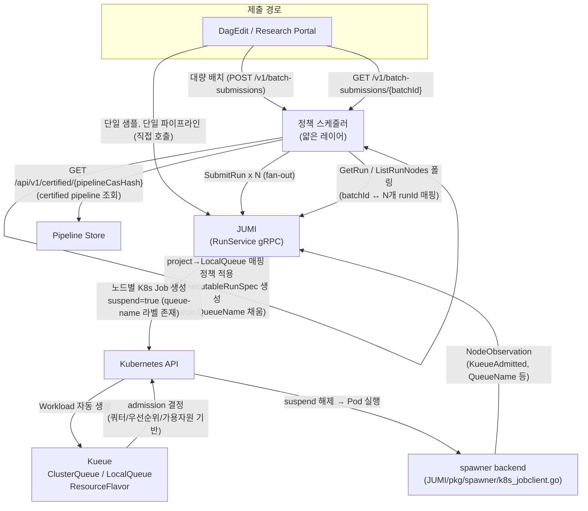

# 정책 스케줄러 (Policy Scheduler) 설계 v0.1 — 초안

Status: Draft (읽기 전용 설계 세션 산출물, 코드/이슈/PR 없음)
작성일: 2026-07-27
출처 컨텍스트: `platform-docs/CERTIFIED_PIPELINE_STORE_DESIGN_v0.1.md` §4-b, §10 마지막 행
(`정책 스케줄러 설계 — 미설계 컴포넌트`), 플랫폼 로드맵 Phase 3 "정책 스케줄러 — Kueue 네이티브
재사용"(제안F) 항목.

이 문서는 **정책 스케줄러 자체의 신규 v0.1 설계**다. Pipeline Store의 미결정 사항(§10)에는
관여하지 않으며, 정책 스케줄러가 Pipeline Store를 어떻게 소비하는지(인터페이스 관점)만 다룬다.

---

## 1. 한 줄 정의

정책 스케줄러는 "연구원이 대량 샘플 배치를 제출"하는 단일 API 요청을 다수의 JUMI
`SubmitRun` 호출로 번역하고, 각 실행에 Kueue 큐/쿼터 정보를 부여하는 **얇은 오케스트레이션
레이어**다. 큐잉·리소스 할당·우선순위·쿼터의 실제 결정 로직은 스스로 구현하지 않고
Kubernetes Kueue에 위임한다.

---

## 2. 설계 원칙 — 왜 Kueue 네이티브 재사용인가

### 2.1 이미 존재하는 기반을 재확인

코드 조사 결과, 이 설계가 올라탈 Kueue 연동은 이미 두 곳에 **독립적으로 구현되어 존재**한다.

- `spawner/cmd/imp/k8s_driver.go:201-202` — `DriverK8s.buildJob()`이
  `labels["kueue.x-k8s.io/queue-name"]` 존재 여부로 `suspend := useKueue`를 결정하고
  `batchv1.Job.Spec.Suspend`에 반영한다. 단, 이 경로는 **spawner 자체의 standalone
  서버/참조 구현 경로**이며 (`cmd/server/main.go`), 프로덕션에서 JUMI가 사용하는 경로가 아니다
  — `DriverK8s`의 doc comment가 이를 명시한다 ("DriverK8s is NOT the path JUMI uses in
  production").
- `JUMI/pkg/spawner/k8s_jobclient.go:404-405` — JUMI가 실제 프로덕션에서 쓰는
  `pkg/runtime.JobClient` 구현체가 **동일한 조건부 로직**(`_, useKueue :=
  labels[labelKueueQueueName]; suspend := useKueue`)을 독립적으로 재구현하고 있다.
- JUMI의 `ExecutableRunSpec`에는 이미 **노드 단위** `Kueue *KueueHints` 필드
  (`QueueName`, `WorkloadClass`, `Labels`, `JUMI/pkg/spec/types.go:146-150`)가 있고, 이 값이
  채워지면 K8s Job에 `kueue.x-k8s.io/queue-name` 라벨과 `spec.suspend=true`가 실제로
  적용된다 (`JUMI_K8S_JOB_LABEL_CONTRACT.md` "Kueue Integration Label" 절). `NodeObservation`도
  `KueueObserved`/`QueueName`/`WorkloadName`/`KueuePendingReason`/`KueueAdmitted` 필드로
  Kueue admission 상태를 이미 관측하고 있다.
- JUMI의 `DagEngine.Admit()`은 run 단위 동시성 게이트가 **없다** — run을 무조건 즉시
  admitted 처리하고 노드 스케줄링을 시작한다. 실제 admission 제어는 전적으로 노드별
  K8s Job의 `suspend` + Kueue ClusterQueue가 담당한다.

즉 "큐에 넣고 리소스가 되면 실행한다"는 배치 실행의 핵심 메커니즘은 **이미 JUMI/spawner
경로에 살아있다.** 지금 빠진 것은 "500개 샘플 요청 1건"을 "Kueue 힌트가 채워진 N개의
`SubmitRun` 호출"로 바꿔주는 얇은 상위 레이어뿐이다.

### 2.2 커스텀 스케줄러 대안과의 비교

커스텀 대안(자체 DB에 큐 상태를 저장하고, 자체 워커가 리소스 가용성을 폴링해 JUMI를
호출하는 방식)은 다음을 전부 재구현해야 한다:

| 커스텀 스케줄러가 새로 만들어야 하는 것 | Kueue가 이미 제공 |
|---|---|
| 큐 자료구조 + 영속화 | Workload CRD (etcd에 이미 영속화됨) |
| 리소스 가용성 폴링/워커 | ClusterQueue 컨트롤러의 admission loop |
| fair-sharing / cohort borrowing 알고리즘 | ClusterQueue `cohort` + 차용(borrowing) 로직 |
| 우선순위 큐 + preemption | WorkloadPriorityClass + preemption policy |
| 프로젝트별 쿼터 강제 | LocalQueue → ClusterQueue nominalQuota |
| 장애 시 상태 복구 | Kueue 컨트롤러가 K8s API 서버 재시작/재연결에 대해 이미 검증됨 |

이 로직들은 Kueue가 CNCF 프로젝트로 이미 검증되어 있고, JUMI/spawner 양쪽에 이미
"Kueue가 있으면 그것에 따른다"는 조건부 연동이 심어져 있다. 커스텀 스케줄러를 새로
만드는 것은 이 검증된 로직을 재발명하면서, 동시에 이미 존재하는 두 개의 조건부
Kueue-suspend 구현(§5 참조)과 별도로 세 번째 판단 지점을 추가하는 셈이 되어 드리프트
위험만 키운다.

### 2.3 "정책 스케줄러"라는 이름에 대한 경계

이 이름은 오해를 부르기 쉽다 — 이 컴포넌트는 스케줄링 알고리즘(우선순위 계산, 리소스
배분 결정)을 구현하지 않는다. 실제 스케줄링 결정은 Kueue 컨트롤러가 클러스터 상태를
보고 내린다. 정책 스케줄러가 하는 일은:

1. 배치 요청을 개별 실행 단위로 분해 (lowering)
2. 각 실행에 어떤 Kueue LocalQueue/우선순위를 붙일지 정책 매핑 (프로젝트→큐 이름 등)
3. JUMI에 N번 제출하고 결과를 배치 단위로 묶어 조회 가능하게 함

"정책"은 스케줄링 알고리즘이 아니라 "이 요청을 어느 큐에, 어떤 우선순위로 보낼지"를
결정하는 **매핑 규칙**을 의미하는 것으로 재해석해야 한다.

---

## 3. 요구사항 → Kueue 개념 매핑표

| 요구사항 (§4-b 원문) | Kueue 개념 | 정책 스케줄러가 하는 일 | 비고 |
|---|---|---|---|
| 실행 요청 큐잉 | `Workload` (Kueue CRD, 노드별 suspended K8s Job에 자동 대응) | 없음 — JUMI가 노드별 Job을 `suspend=true`로 생성하면 Kueue가 자동으로 Workload를 만든다 | 정책 스케줄러는 Workload를 직접 만들지 않는다. `ExecutableRunSpec.Graph.Nodes[].Kueue.QueueName`을 채워 이 경로를 활성화시킬 뿐 |
| 리소스 할당 정책 | `ResourceFlavor` + `ClusterQueue.spec.resourceGroups` | 없음 — 클러스터 운영자가 사전 구성 | 노드풀/GPU 종류별 flavor 정의는 이 설계의 범위 밖 (조직적/인프라 결정) |
| 우선순위 결정 | `WorkloadPriorityClass` | ⚠ **갭 있음** — 정책 스케줄러가 요청에 우선순위를 실어 보내도 JUMI 쪽에 실제 배선이 없다 (§8 참조) | `KueueHints.WorkloadClass` 필드는 존재하지만 JUMI 코드 어디에서도 소비(consume)되지 않는 죽은 필드로 확인됨 |
| 사용자/프로젝트 쿼터 | `LocalQueue` → `ClusterQueue` 매핑 + `nominalQuota`, cohort 차용 | 프로젝트 식별자 → LocalQueue 이름 매핑 정책을 정의 | "프로젝트 = 네임스페이스" 1:1 여부는 미결정 (§8) |

---

## 4. 아키텍처



핵심: 정책 스케줄러는 Kueue의 admission 파이프라인에 직접 끼어들지 않는다.
Kueue↔spawner↔K8s 사이의 실제 admission/suspend 로직은 이미 존재하는 JUMI 프로덕션
경로(`k8s_jobclient.go`)를 그대로 통과한다. 정책 스케줄러의 개입 지점은 오직
"제출 전 ExecutableRunSpec에 어떤 Kueue 힌트를 실어 보내는가"뿐이다.

---

## 5. spawner `suspend` 로직과의 관계 (spawner#1)

지도 문서의 "spawner: Kueue suspend=true 하드코딩(P0 블로커)" 표현은 코드 확인 결과
**부정확하다** — `suspend`는 항상 `true`로 하드코딩된 것이 아니라
`suspend := useKueue` (즉 `kueue.x-k8s.io/queue-name` 라벨의 유무에 따른 조건부)이다.
이 조건부 로직은 `spawner/cmd/imp/k8s_driver.go`와 JUMI 프로덕션 경로인
`JUMI/pkg/spawner/k8s_jobclient.go` 양쪽에 **동일하게, 그러나 독립적으로** 구현되어 있다.

`spawner#1` (open, P2)은 정확히 이 두 경로의 중복/드리프트 위험을 지적한 이슈다: "두
구현이 지금은 같은 conditional-suspend 동작을 하지만, 서로 다른 구현이라 나중에
드리프트하지 않는다는 구조적 보장이 없다."

이 설계와의 관계:

- 정책 스케줄러는 **JUMI 프로덕션 경로(`k8s_jobclient.go`)만** 거친다. `DriverK8s`는
  spawner standalone/reference 경로이며 프로덕션 트래픽과 무관하므로 이 설계에서
  다루지 않는다.
- 정책 스케줄러는 이 conditional-suspend 로직을 "대체"하지 않는다. 오히려 이 로직을
  **정상적으로 트리거하는 상위 호출자**가 된다 — 배치 경로에서 `KueueHints.QueueName`을
  채워 넣는 책임을 정책 스케줄러가 맡음으로써, 지금까지 명시적 호출자가 없어 사실상
  활성화되지 않았던 경로를 실제로 사용하게 만든다.
- `spawner#1`이 해결되어 두 경로가 하나로 정리되면 정책 스케줄러 입장에서 신뢰할 단일
  계약이 생기므로 유리하지만, 이 설계의 전제 조건은 아니다. spawner/JUMI 코드 수정은
  이 세션의 범위 밖이며 착수하지 않았다.

---

## 6. API 계약 스케치

연구원이 "wgs-germline v1.2로 샘플 500개 분석 요청"을 제출하는 흐름:

### 6.1 배치 제출

```
POST /v1/batch-submissions
{
  "pipelineCasHash": "sha256:abc123...",     // Pipeline Store certified pipeline 참조
  "project": "proj-genomics-01",              // → LocalQueue 매핑 키
  "requestedBy": "researcher@example.org",
  "priorityClass": "standard",                // 갭 있음 — §8 참조. 현재는 기록만, 실배선 없음
  "samples": [
    { "sampleId": "S001", "sampleFixtureRef": "nfs://.../S001" },
    { "sampleId": "S002", "sampleFixtureRef": "nfs://.../S002" }
    // ... 총 500개
  ]
}
```

```
202 Accepted
{
  "batchId": "batch-2026-07-27-0001",
  "acceptedSamples": 500,
  "rejectedSamples": [],          // lowering 단계에서 즉시 실패한 항목 (예: 잘못된 sampleFixtureRef)
  "queueName": "proj-genomics-01-lq"
}
```

내부적으로 정책 스케줄러는 `pipelineCasHash`로 Pipeline Store에서 pipelineSpec을 가져와
샘플마다 파라미터화한 `ExecutableRunSpec`을 만들고, 각 노드에
`Kueue.QueueName = "proj-genomics-01-lq"`를 채워 JUMI `SubmitRun`을 500회 호출한다.
호출당 응답 `RunID`를 `batchId`에 매핑해 저장한다.

### 6.2 배치 상태 조회

```
GET /v1/batch-submissions/{batchId}
```
```
200 OK
{
  "batchId": "batch-2026-07-27-0001",
  "status": "partially-running",     // queued | partially-running | completed | failed
  "counters": { "total": 500, "kueueAdmitted": 120, "running": 45, "succeeded": 30, "failed": 2 },
  "runs": [
    { "sampleId": "S001", "jumiRunId": "run-...", "kueueQueueName": "proj-genomics-01-lq",
      "kueueAdmitted": true, "status": "running" }
    // ...
  ]
}
```

이 조회는 정책 스케줄러가 JUMI `GetRun`/`ListRunNodes`를 배치에 속한 N개 runId에 대해
폴링(또는 배치 처리)해 집계한 결과다. JUMI에는 웹훅/콜백이 없고 `ListRunEvents`만
있으므로, 폴링 주기와 부하는 미결정 사항(§8)으로 남긴다.

---

## 7. Pipeline Store와의 관계

정책 스케줄러는 Pipeline Store의 **read-only 소비자**다.

- `GET /api/v1/certified/{pipelineCasHash}` (Pipeline Store 설계 문서 §6.1 "옵션 A")로
  certified pipeline spec을 조회한다.
- certify/promotion 흐름(DagEdit → Pipeline Store → JUMI dry-run → certified 저장)에는
  전혀 관여하지 않는다 — 정책 스케줄러는 이미 certified된 pipeline만 배치 실행 대상으로
  받는다.
- pipelineSpec을 샘플별 `ExecutableRunSpec`으로 바꾸는 "lowering" 로직이 정책 스케줄러
  내부(§9 `pkg/lowering`)에 있을지, 아니면 Pipeline Store/별도 컴포넌트가 이미 하는
  lowering(로드맵 Phase 3 "Pipeline Store — DagEdit → 저장 → Lowering → JUMI" 항목)을
  재사용할지는 **미결정**이다 (§8). 두 lowering이 별도로 존재하면 로직 중복/드리프트
  위험이 생기므로, 착수 전 반드시 확인이 필요하다.
- Pipeline Store 자체의 미결정 사항(§10 표: dry-run 요청 방식, 콜백 vs polling, 인증,
  고가용성, deprecation UI)은 이 설계에서 다루지 않는다. 다른 에이전트가 작업 중이다.

---

## 8. 미결정 사항 (조직적 결정 필요 — 억지로 확정하지 않음)

| 항목 | 내용 |
|---|---|
| 우선순위(WorkloadPriorityClass) 실배선 | `KueueHints.WorkloadClass` 필드는 spec에 존재하지만 JUMI 코드 어디에서도 K8s `priorityClassName`으로 소비되지 않는 죽은 필드로 확인됨. 정책 스케줄러가 우선순위 정책을 실제로 강제하려면 JUMI 쪽(`k8s_jobclient.go`)에 이 배선을 먼저 추가해야 함 — 이 세션/이 repo(NodeKit) 범위 밖, JUMI 담당 팀 결정 필요 |
| lowering 책임 소재 | pipelineSpec + 샘플 목록 → N개 `ExecutableRunSpec` 변환 로직을 정책 스케줄러가 가질지, 로드맵 Phase 3의 별도 "Lowering" 컴포넌트를 재사용할지 |
| 프로젝트=네임스페이스 1:1 매핑 여부 | LocalQueue를 네임스페이스 단위로 둘지, 네임스페이스 안에 프로젝트별 LocalQueue를 여러 개 둘지 — 쿼터 단위 결정에 직결 |
| ClusterQueue/ResourceFlavor 사전 구성 소유권 | 클러스터 운영(seoy 장비 등 인프라 담당) vs NodeVault — 이 설계는 정책 스케줄러가 이를 만들지 않는다고만 전제 |
| 배치 상태 관측 방식 | 정책 스케줄러가 JUMI를 주기적으로 폴링(`ListRunNodes`/`GetRun`)할지, JUMI에 이벤트 구독/웹훅을 새로 추가할지 (현재 JUMI에는 웹훅 없음, `ListRunEvents`만 존재 — 이것도 폴링 기반) |
| 인증/인가 | 어느 사용자가 몇 개까지 배치 제출 가능한지, 쿼터 초과 시 UX (즉시 거부 vs 큐에 넣고 대기) |
| kube-slint 연계 여부 | §4-b 원문은 kube-slint가 정책 스케줄러의 대체재가 아니라고만 명시 — 배치 진행 상황을 kube-slint 관측 레이어에 노출할지는 언급 없음, 이 설계에서도 정하지 않음 |
| 신규 repo 이름/소유 | 아래 §9는 패키지 구조 제안일 뿐, repo 이름(`PolicyScheduler` 등)과 소유 조직은 미확정 |
| 실패/부분 실패 정책 | 500개 중 일부가 lowering 단계에서 실패하면 나머지를 계속 진행할지, 배치 전체를 거부할지 — API 스킵(§6.1의 `rejectedSamples`)만 스케치했고 정책은 미정 |

---

## 9. 신규 repo 패키지 구조 제안

```
github.com/HeaInSeo/PolicyScheduler/
  cmd/
    policy-scheduler/
      main.go
  pkg/
    api/
      handler.go        ← REST 핸들러 (POST /v1/batch-submissions, GET /v1/batch-submissions/{id})
      handler_test.go
    lowering/
      lowering.go        ← pipelineSpec + 샘플 목록 → N x ExecutableRunSpec 변환
      lowering_test.go   ← (§8 미결정: Pipeline Store 쪽 Lowering과 통합 여부에 따라 이 패키지 자체가 없어질 수 있음)
    queuemap/
      queuemap.go        ← project → Kueue LocalQueue 이름 매핑 정책
      queuemap_test.go
    jumi/
      client.go          ← JUMI gRPC 클라이언트 래핑 (SubmitRun fan-out, GetRun/ListRunNodes 폴링)
      client_test.go
    pipelinestore/
      client.go          ← Pipeline Store REST 클라이언트 (certified pipeline 조회)
      client_test.go
    batchstore/
      store.go           ← batchId ↔ N개 runId 매핑 영속화 (배치 상태 조회용)
      store_test.go
  deploy/
    policy-scheduler.service   ← systemd unit (Pipeline Store 문서 §9와 동일한 배포 관례)
  go.mod
```

---

## 10. 요약

- 큐잉·리소스할당·우선순위·쿼터 요구사항 중 큐잉/리소스할당/쿼터는 Kueue 개념에 거의
  1:1로 대응되고, 이미 JUMI 프로덕션 경로에 활성화 가능한 형태로 존재한다.
- 우선순위만 유일하게 JUMI 쪽 실배선 갭이 있다 (`WorkloadClass` 필드가 죽어있음).
- 정책 스케줄러의 실제 신규 구현 범위는 "배치 요청 → N개 JUMI SubmitRun 번역 + 배치
  상태 집계"로 좁다 — 스케줄링 알고리즘 자체를 만들지 않는다.
- spawner#1 이슈가 지적한 두 경로 드리프트 위험은 이 설계와 별개 트랙이며, 정책
  스케줄러는 프로덕션 경로만 사용하므로 직접 영향은 없다.
